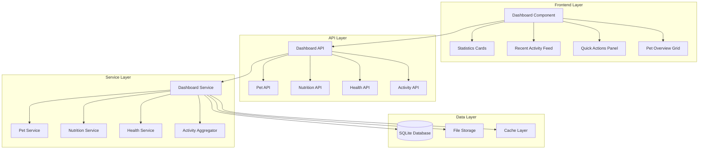

# Design Document

## Overview

The dashboard improvement feature will create a unified, dynamic dashboard that serves as the central hub for all pet management activities. The design focuses on real-time data integration, consistent user experience, and intelligent insights while maintaining the existing application architecture.

## Architecture

### High-Level Architecture



### Component Architecture

The dashboard will be built using a modular component architecture that integrates with the existing ANMS application structure:

1. **Dashboard Controller** - Orchestrates data fetching and component rendering
2. **Statistics Manager** - Calculates and caches dashboard metrics
3. **Activity Aggregator** - Collects and formats recent activities from all features
4. **Quick Actions Handler** - Manages modal interactions and feature navigation
5. **Real-time Updater** - Handles automatic data refresh and notifications

## Components and Interfaces

### 1. Dashboard Statistics Component

**Purpose**: Display real-time metrics about pets, nutrition, and health

**Interface**:
```javascript
class DashboardStatistics {
    constructor(apiClient, cacheManager)
    async loadStatistics(userId)
    updateStatistic(key, value)
    subscribeToUpdates(callback)
}
```

**Data Structure**:
```json
{
  "total_pets": 3,
  "pets_this_month": 1,
  "meals_today": 6,
  "upcoming_meals": 2,
  "health_score": 95,
  "health_change": 3,
  "next_checkup": 12,
  "last_updated": "2025-01-08T10:30:00Z"
}
```

### 2. Recent Activity Feed Component

**Purpose**: Show chronological list of activities across all features

**Interface**:
```javascript
class ActivityFeed {
    constructor(apiClient, eventBus)
    async loadActivities(userId, limit = 10)
    addActivity(activity)
    filterActivities(type)
    formatActivity(activity)
}
```

**Activity Data Structure**:
```json
{
  "id": "activity_123",
  "type": "pet_added|meal_logged|health_updated|photo_uploaded",
  "icon": "fas fa-plus",
  "description": "Added new pet: Buddy",
  "timestamp": "2025-01-08T09:15:00Z",
  "time_ago": "2 hours ago",
  "pet_id": 1,
  "metadata": {}
}
```

### 3. Quick Actions Panel Component

**Purpose**: Provide one-click access to common tasks

**Interface**:
```javascript
class QuickActions {
    constructor(modalManager, navigationManager)
    registerAction(name, config)
    executeAction(actionName, context)
    updateActionAvailability()
}
```

**Action Configuration**:
```json
{
  "add_pet": {
    "icon": "fas fa-plus",
    "label": "Add New Pet",
    "handler": "showAddPetModal",
    "requires_pets": false
  },
  "plan_meal": {
    "icon": "fas fa-utensils",
    "label": "Plan Meal",
    "handler": "openMealPlanner",
    "requires_pets": true
  }
}
```

### 4. Pet Overview Grid Component

**Purpose**: Display pet cards with key information and quick actions

**Interface**:
```javascript
class PetOverviewGrid {
    constructor(petService, photoService)
    async loadPets(userId)
    renderPetCard(pet)
    updatePetStatus(petId, status)
    handlePetAction(petId, action)
}
```

### 5. Dashboard API Endpoints

**New Endpoint**: `/api/dashboard.php`

**Enhanced Functionality**:
- Aggregate statistics from multiple sources
- Cache frequently accessed data
- Support real-time updates via WebSocket (future enhancement)

**Existing Endpoints to Enhance**:
- `/api/pets.php` - Add dashboard-specific pet summaries
- `/api-bridge.php` - Add activity logging for all actions

## Data Models

### Dashboard Statistics Model

```php
class DashboardStatistics {
    private int $userId;
    private int $totalPets;
    private int $petsThisMonth;
    private int $mealsToday;
    private int $upcomingMeals;
    private float $healthScore;
    private int $healthChange;
    private int $nextCheckup;
    private DateTime $lastUpdated;
    
    public function calculate(): array;
    public function cache(int $ttl = 300): void;
    public static function fromCache(int $userId): ?self;
}
```

### Activity Model

```php
class Activity {
    private string $id;
    private int $userId;
    private string $type;
    private string $description;
    private DateTime $timestamp;
    private ?int $petId;
    private array $metadata;
    
    public function toArray(): array;
    public function getTimeAgo(): string;
    public static function create(string $type, int $userId, array $data): self;
}
```

### Dashboard Configuration Model

```php
class DashboardConfig {
    private int $userId;
    private array $visibleCards;
    private array $quickActions;
    private int $refreshInterval;
    private array $preferences;
    
    public function getDefaultConfig(): array;
    public function updatePreferences(array $preferences): void;
}
```

## Error Handling

### Error Categories

1. **Network Errors** - API unavailable, timeout
2. **Data Errors** - Invalid response, missing data
3. **Authentication Errors** - Session expired, unauthorized
4. **Validation Errors** - Invalid input, constraint violations

### Error Handling Strategy

```javascript
class ErrorHandler {
    handleApiError(error, context) {
        switch (error.type) {
            case 'network':
                return this.showOfflineMode(context);
            case 'auth':
                return this.redirectToLogin();
            case 'data':
                return this.showFallbackData(context);
            default:
                return this.showGenericError(error);
        }
    }
    
    showOfflineMode(context) {
        // Display cached data with offline indicator
    }
    
    showFallbackData(context) {
        // Show placeholder or default values
    }
}
```

### Graceful Degradation

- **Statistics Cards**: Show cached values with timestamp
- **Activity Feed**: Display "Unable to load recent activities" with retry button
- **Quick Actions**: Disable actions that require API calls
- **Pet Grid**: Show basic pet information from cache

## Testing Strategy

### Unit Tests

1. **Statistics Calculation Tests**
   - Test various pet configurations
   - Verify health score calculations
   - Test edge cases (no pets, invalid data)

2. **Activity Aggregation Tests**
   - Test activity creation and formatting
   - Verify chronological ordering
   - Test filtering and pagination

3. **Component Integration Tests**
   - Test data flow between components
   - Verify event handling
   - Test error propagation

### Integration Tests

1. **API Integration Tests**
   - Test dashboard API endpoints
   - Verify data consistency across APIs
   - Test authentication and authorization

2. **Database Integration Tests**
   - Test statistics queries performance
   - Verify data integrity
   - Test concurrent access scenarios

### End-to-End Tests

1. **Dashboard Loading Tests**
   - Test initial page load performance
   - Verify all components render correctly
   - Test responsive behavior

2. **User Interaction Tests**
   - Test quick actions functionality
   - Verify modal interactions
   - Test navigation between features

3. **Real-time Update Tests**
   - Test automatic data refresh
   - Verify activity feed updates
   - Test notification system

### Performance Tests

1. **Load Time Tests**
   - Dashboard should load within 2 seconds
   - Statistics should update within 500ms
   - Activity feed should load within 1 second

2. **Memory Usage Tests**
   - Monitor JavaScript memory usage
   - Test for memory leaks in long sessions
   - Verify cache efficiency

3. **Database Performance Tests**
   - Statistics queries should execute under 100ms
   - Activity queries should handle 1000+ records
   - Test query optimization

## Implementation Phases

### Phase 1: Core Dashboard Structure
- Create dashboard layout and navigation
- Implement basic statistics cards
- Set up API endpoints for dashboard data
- Add error handling and loading states

### Phase 2: Activity Feed and Quick Actions
- Implement activity aggregation system
- Create quick actions panel
- Add modal integration for common tasks
- Implement activity logging across features

### Phase 3: Real-time Updates and Optimization
- Add automatic data refresh
- Implement caching strategy
- Optimize database queries
- Add performance monitoring

### Phase 4: Advanced Features and Polish
- Add intelligent insights and recommendations
- Implement user preferences
- Add accessibility improvements
- Optimize for mobile devices

## Security Considerations

### Authentication and Authorization
- All dashboard APIs require valid session or JWT token
- User can only access their own pet data
- Activity logs are user-scoped

### Data Privacy
- Sensitive pet health data is encrypted at rest
- Activity logs don't contain sensitive information
- Cache data is user-scoped and expires appropriately

### Input Validation
- All user inputs are validated and sanitized
- API endpoints use prepared statements
- File uploads are restricted and validated

## Performance Optimization

### Caching Strategy
- Statistics cached for 5 minutes
- Activity feed cached for 1 minute
- Pet data cached for 10 minutes
- User preferences cached for 1 hour

### Database Optimization
- Add indexes for dashboard queries
- Use connection pooling for concurrent requests
- Implement query result caching
- Optimize JOIN operations for statistics

### Frontend Optimization
- Lazy load non-critical components
- Use virtual scrolling for large activity lists
- Implement service worker for offline functionality
- Optimize bundle size with code splitting

## Accessibility

### WCAG 2.1 AA Compliance
- All interactive elements are keyboard accessible
- Color contrast ratios meet AA standards
- Screen reader support for all components
- Focus management for modal interactions

### Responsive Design
- Mobile-first approach
- Touch-friendly interface elements
- Optimized layouts for all screen sizes
- Progressive enhancement for advanced features

## Monitoring and Analytics

### Performance Monitoring
- Track page load times
- Monitor API response times
- Measure user interaction latency
- Alert on performance degradation

### User Analytics
- Track feature usage patterns
- Monitor error rates and types
- Measure user engagement metrics
- A/B test dashboard layouts

### System Health
- Monitor database performance
- Track cache hit rates
- Monitor memory usage
- Alert on system errors