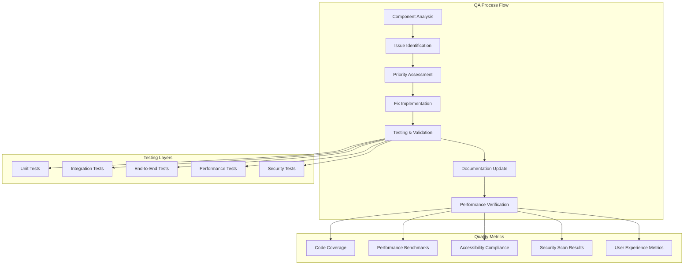

# Design Document

## Overview

The Production Quality Assurance design focuses on systematically reviewing and enhancing the existing Animal Nutrition Management System (ANMS) to achieve production-grade quality. The current system demonstrates sophisticated modern web development practices with a well-structured PHP backend, comprehensive JavaScript frontend, and professional design system.

The design approach will follow a methodical quality assurance methodology that examines each component layer by layer, identifies improvement opportunities, implements fixes, and validates functionality. This ensures the existing architecture is preserved while enhancing reliability, performance, and user experience.

## Architecture

### Current System Analysis

The existing ANMS architecture follows modern web development best practices:

**Frontend Architecture:**
- Modern HTML5 with semantic markup and accessibility features
- CSS design system with custom properties and component-based architecture
- Vanilla JavaScript with ES6+ modules and class-based components
- Responsive design with mobile-first approach
- Progressive Web App capabilities with service workers

**Backend Architecture:**
- PHP 8.2+ with modern features and strict typing
- Domain-Driven Design with clear separation of concerns
- Repository pattern for data access abstraction
- RESTful API with proper HTTP methods and status codes
- JWT-based authentication with session management

**Database Architecture:**
- MySQL 8.0 with optimized schema design
- Proper foreign key relationships and constraints
- Migration system for version control
- Seeding system for test data

### Quality Assurance Framework



## Components and Interfaces

### 1. Landing Page Quality Assurance

**Current State Analysis:**
- Professional design with gradient backgrounds and modern typography
- Comprehensive marketing content with features, testimonials, and pricing
- Responsive navigation with mobile menu functionality
- Call-to-action buttons integrated with authentication modals

**Quality Improvements:**
- Verify all animations and transitions work smoothly across browsers
- Ensure all links and buttons function correctly
- Validate responsive behavior on all device sizes
- Test loading performance and optimize assets
- Verify accessibility compliance (WCAG 2.1 AA)

**Testing Strategy:**
```javascript
// Landing Page Test Suite
class LandingPageTests {
    testNavigationFunctionality() {
        // Test all navigation links
        // Verify smooth scrolling to sections
        // Test mobile menu toggle
    }
    
    testCallToActionButtons() {
        // Test registration modal opening
        // Test login modal opening
        // Verify form submissions
    }
    
    testResponsiveDesign() {
        // Test breakpoints: 320px, 768px, 1024px, 1440px
        // Verify layout integrity
        // Test touch interactions on mobile
    }
    
    testPerformance() {
        // Measure page load time
        // Test image optimization
        // Verify CSS/JS minification
    }
}
```

### 2. Authentication System Enhancement

**Current State Analysis:**
- JWT-based authentication with proper token management
- Registration and login forms with validation
- Session management with auto-refresh capabilities
- Role-based access control implementation

**Quality Improvements:**
- Enhance form validation with real-time feedback
- Improve error messaging for better user experience
- Add password strength indicators
- Implement proper loading states during authentication
- Add two-factor authentication support

**Security Enhancements:**
```php
// Enhanced Authentication Security
class AuthenticationSecurity {
    public function validatePasswordStrength(string $password): array {
        $requirements = [
            'length' => strlen($password) >= 8,
            'uppercase' => preg_match('/[A-Z]/', $password),
            'lowercase' => preg_match('/[a-z]/', $password),
            'numbers' => preg_match('/\d/', $password),
            'special' => preg_match('/[^A-Za-z0-9]/', $password)
        ];
        
        return [
            'valid' => !in_array(false, $requirements),
            'requirements' => $requirements,
            'score' => array_sum($requirements)
        ];
    }
    
    public function implementRateLimiting(): void {
        // Implement login attempt rate limiting
        // Add CAPTCHA after failed attempts
        // Log suspicious activities
    }
}
```

### 3. Pet Management System Optimization

**Current State Analysis:**
- Comprehensive pet profile creation and editing
- Photo upload functionality with preview
- Health data tracking and visualization
- Pet deletion with confirmation dialogs

**Quality Improvements:**
- Enhance form validation with better error messaging
- Improve photo upload with drag-and-drop functionality
- Add bulk operations for multiple pets
- Implement data export capabilities
- Add pet sharing features for veterinarians

**Data Validation Framework:**
```javascript
// Pet Data Validation
class PetDataValidator {
    validatePetProfile(petData) {
        const rules = {
            name: { required: true, minLength: 2, maxLength: 50 },
            species: { required: true, enum: ['dog', 'cat', 'rabbit', 'bird'] },
            breed: { maxLength: 100 },
            age: { type: 'number', min: 0, max: 30 },
            weight: { type: 'number', min: 0.1, max: 200 },
            activityLevel: { enum: ['low', 'moderate', 'high'] }
        };
        
        return this.validate(petData, rules);
    }
    
    validateHealthRecord(healthData) {
        // Implement health record validation
        // Check date ranges and value constraints
        // Validate medical terminology
    }
}
```

### 4. Health Tracking System Enhancement

**Current State Analysis:**
- Weight tracking with trend analysis
- Health record management with categorization
- Medication tracking and reminders
- Health dashboard with visualizations

**Quality Improvements:**
- Enhance chart visualizations with interactive features
- Add health goal setting and progress tracking
- Implement health alerts and notifications
- Add veterinarian collaboration features
- Improve data export and sharing capabilities

**Health Analytics Engine:**
```php
// Health Analytics Enhancement
class HealthAnalytics {
    public function calculateHealthTrends(array $healthRecords): array {
        return [
            'weight_trend' => $this->analyzeWeightTrend($healthRecords),
            'health_score' => $this->calculateHealthScore($healthRecords),
            'risk_factors' => $this->identifyRiskFactors($healthRecords),
            'recommendations' => $this->generateRecommendations($healthRecords)
        ];
    }
    
    public function generateHealthAlerts(Pet $pet): array {
        // Implement intelligent health alerting
        // Check for concerning trends
        // Generate actionable recommendations
    }
}
```

### 5. Nutrition Planning System Refinement

**Current State Analysis:**
- Scientific nutrition calculations based on pet characteristics
- Meal planning with portion recommendations
- Food database with nutritional information
- Custom diet plan generation

**Quality Improvements:**
- Enhance calculation accuracy with updated formulas
- Add more comprehensive food database
- Implement dietary restriction handling
- Add meal planning calendar interface
- Improve nutrition visualization

**Nutrition Calculation Engine:**
```php
// Enhanced Nutrition Calculations
class NutritionCalculator {
    public function calculateDailyRequirements(Pet $pet): NutritionalRequirements {
        $baseRequirements = $this->getBaseRequirements($pet->getSpecies());
        $adjustments = $this->calculateAdjustments($pet);
        
        return new NutritionalRequirements([
            'calories' => $this->adjustCalories($baseRequirements->calories, $adjustments),
            'protein' => $this->adjustProtein($baseRequirements->protein, $adjustments),
            'fat' => $this->adjustFat($baseRequirements->fat, $adjustments),
            'carbohydrates' => $this->adjustCarbs($baseRequirements->carbs, $adjustments),
            'fiber' => $this->adjustFiber($baseRequirements->fiber, $adjustments)
        ]);
    }
    
    private function calculateAdjustments(Pet $pet): array {
        return [
            'age_factor' => $this->getAgeFactor($pet->getAge(), $pet->getLifeStage()),
            'activity_factor' => $this->getActivityFactor($pet->getActivityLevel()),
            'health_factor' => $this->getHealthFactor($pet->getHealthConditions()),
            'weight_factor' => $this->getWeightFactor($pet->getCurrentWeight(), $pet->getIdealWeight())
        ];
    }
}
```

### 6. User Interface Component System

**Current State Analysis:**
- Comprehensive design system with CSS custom properties
- Reusable component library with consistent styling
- Modal system with proper accessibility
- Notification system with different types

**Quality Improvements:**
- Enhance accessibility compliance across all components
- Add keyboard navigation support
- Improve focus management in modals
- Add animation and transition polish
- Implement dark mode support

**Component Enhancement Framework:**
```css
/* Enhanced Component System */
.component {
    /* Base component styles with improved accessibility */
    --component-focus-color: var(--primary-500);
    --component-focus-width: 2px;
    --component-focus-style: solid;
    
    &:focus-visible {
        outline: var(--component-focus-width) var(--component-focus-style) var(--component-focus-color);
        outline-offset: 2px;
    }
    
    &[aria-disabled="true"] {
        opacity: 0.6;
        pointer-events: none;
        cursor: not-allowed;
    }
    
    /* Enhanced animation support */
    transition: all var(--transition-duration) var(--transition-timing);
    
    @media (prefers-reduced-motion: reduce) {
        transition: none;
        animation: none;
    }
}

/* Dark mode support */
@media (prefers-color-scheme: dark) {
    :root {
        --background-primary: var(--gray-900);
        --text-primary: var(--gray-100);
        --border-primary: var(--gray-700);
    }
}
```

## Data Models

### Enhanced Data Validation

The existing data models will be enhanced with comprehensive validation and business logic:

```php
// Enhanced Pet Model with Validation
class Pet {
    private function validateHealthConditions(array $conditions): void {
        $validConditions = [
            'diabetes', 'arthritis', 'kidney_disease', 'heart_disease',
            'allergies', 'obesity', 'dental_issues', 'skin_conditions'
        ];
        
        foreach ($conditions as $condition) {
            if (!in_array($condition, $validConditions)) {
                throw new InvalidArgumentException("Invalid health condition: {$condition}");
            }
        }
    }
    
    private function validateWeight(float $weight): void {
        if ($weight <= 0 || $weight > 200) {
            throw new InvalidArgumentException("Weight must be between 0.1 and 200 kg");
        }
    }
    
    public function calculateBMI(): float {
        // Implement species-specific BMI calculation
        return $this->weight / pow($this->height / 100, 2);
    }
}
```

### Data Integrity Enhancements

```sql
-- Enhanced database constraints and triggers
ALTER TABLE pets ADD CONSTRAINT check_weight_positive CHECK (current_weight > 0);
ALTER TABLE pets ADD CONSTRAINT check_age_reasonable CHECK (age >= 0 AND age <= 30);

-- Add audit trail for important changes
CREATE TABLE pet_audit_log (
    id BIGINT PRIMARY KEY AUTO_INCREMENT,
    pet_id BIGINT NOT NULL,
    changed_field VARCHAR(100) NOT NULL,
    old_value TEXT,
    new_value TEXT,
    changed_by BIGINT NOT NULL,
    changed_at TIMESTAMP DEFAULT CURRENT_TIMESTAMP,
    FOREIGN KEY (pet_id) REFERENCES pets(id),
    FOREIGN KEY (changed_by) REFERENCES users(id)
);

-- Trigger for automatic audit logging
DELIMITER //
CREATE TRIGGER pet_audit_trigger 
    AFTER UPDATE ON pets
    FOR EACH ROW
BEGIN
    IF OLD.current_weight != NEW.current_weight THEN
        INSERT INTO pet_audit_log (pet_id, changed_field, old_value, new_value, changed_by)
        VALUES (NEW.id, 'current_weight', OLD.current_weight, NEW.current_weight, NEW.updated_by);
    END IF;
END//
DELIMITER ;
```

## Error Handling

### Enhanced Error Management System

```javascript
// Comprehensive Error Handling
class ErrorManager {
    constructor() {
        this.errorTypes = {
            VALIDATION: 'validation',
            NETWORK: 'network',
            AUTHENTICATION: 'authentication',
            AUTHORIZATION: 'authorization',
            SERVER: 'server',
            CLIENT: 'client'
        };
    }
    
    handleError(error, context = {}) {
        const errorInfo = this.categorizeError(error);
        
        // Log error for debugging
        this.logError(errorInfo, context);
        
        // Show user-friendly message
        this.displayUserMessage(errorInfo);
        
        // Take corrective action if possible
        this.attemptRecovery(errorInfo, context);
    }
    
    categorizeError(error) {
        if (error.status === 401) return { type: this.errorTypes.AUTHENTICATION, ...error };
        if (error.status === 403) return { type: this.errorTypes.AUTHORIZATION, ...error };
        if (error.status >= 400 && error.status < 500) return { type: this.errorTypes.CLIENT, ...error };
        if (error.status >= 500) return { type: this.errorTypes.SERVER, ...error };
        if (!navigator.onLine) return { type: this.errorTypes.NETWORK, ...error };
        
        return { type: this.errorTypes.CLIENT, ...error };
    }
    
    displayUserMessage(errorInfo) {
        const messages = {
            [this.errorTypes.VALIDATION]: 'Please check your input and try again.',
            [this.errorTypes.NETWORK]: 'Please check your internet connection and try again.',
            [this.errorTypes.AUTHENTICATION]: 'Please log in again to continue.',
            [this.errorTypes.AUTHORIZATION]: 'You don\'t have permission to perform this action.',
            [this.errorTypes.SERVER]: 'We\'re experiencing technical difficulties. Please try again later.',
            [this.errorTypes.CLIENT]: 'Something went wrong. Please try again.'
        };
        
        const message = messages[errorInfo.type] || messages[this.errorTypes.CLIENT];
        this.ui.showError(message);
    }
}
```

## Testing Strategy

### Comprehensive Testing Framework

```javascript
// Testing Strategy Implementation
class QualityAssuranceTests {
    constructor() {
        this.testSuites = [
            new LandingPageTests(),
            new AuthenticationTests(),
            new PetManagementTests(),
            new HealthTrackingTests(),
            new NutritionPlanningTests(),
            new UIComponentTests(),
            new APIIntegrationTests(),
            new PerformanceTests(),
            new AccessibilityTests(),
            new SecurityTests()
        ];
    }
    
    async runAllTests() {
        const results = [];
        
        for (const suite of this.testSuites) {
            console.log(`Running ${suite.constructor.name}...`);
            const result = await suite.run();
            results.push(result);
        }
        
        return this.generateReport(results);
    }
    
    generateReport(results) {
        const totalTests = results.reduce((sum, result) => sum + result.total, 0);
        const passedTests = results.reduce((sum, result) => sum + result.passed, 0);
        const failedTests = totalTests - passedTests;
        
        return {
            summary: {
                total: totalTests,
                passed: passedTests,
                failed: failedTests,
                coverage: (passedTests / totalTests) * 100
            },
            details: results
        };
    }
}
```

### Performance Testing

```javascript
// Performance Testing Suite
class PerformanceTests {
    async testPageLoadTimes() {
        const pages = [
            '/',
            '/dashboard',
            '/pets',
            '/nutrition',
            '/health'
        ];
        
        const results = {};
        
        for (const page of pages) {
            const startTime = performance.now();
            await this.loadPage(page);
            const endTime = performance.now();
            
            results[page] = {
                loadTime: endTime - startTime,
                passed: (endTime - startTime) < 2000 // 2 second threshold
            };
        }
        
        return results;
    }
    
    async testAPIResponseTimes() {
        const endpoints = [
            { method: 'GET', url: '/api/pets' },
            { method: 'POST', url: '/api/pets' },
            { method: 'GET', url: '/api/health/records' },
            { method: 'POST', url: '/api/nutrition/calculate' }
        ];
        
        const results = {};
        
        for (const endpoint of endpoints) {
            const startTime = performance.now();
            await this.makeAPICall(endpoint);
            const endTime = performance.now();
            
            results[`${endpoint.method} ${endpoint.url}`] = {
                responseTime: endTime - startTime,
                passed: (endTime - startTime) < 500 // 500ms threshold
            };
        }
        
        return results;
    }
}
```

## Security Considerations

### Enhanced Security Measures

```php
// Security Enhancement Framework
class SecurityEnhancements {
    public function implementCSRFProtection(): void {
        // Generate and validate CSRF tokens
        if (!hash_equals($_SESSION['csrf_token'], $_POST['csrf_token'])) {
            throw new SecurityException('CSRF token mismatch');
        }
    }
    
    public function sanitizeInput(array $input): array {
        return array_map(function($value) {
            if (is_string($value)) {
                return htmlspecialchars(trim($value), ENT_QUOTES, 'UTF-8');
            }
            return $value;
        }, $input);
    }
    
    public function validateFileUpload(array $file): void {
        $allowedTypes = ['image/jpeg', 'image/png', 'image/gif'];
        $maxSize = 5 * 1024 * 1024; // 5MB
        
        if (!in_array($file['type'], $allowedTypes)) {
            throw new SecurityException('Invalid file type');
        }
        
        if ($file['size'] > $maxSize) {
            throw new SecurityException('File too large');
        }
        
        // Additional security checks
        $this->scanForMalware($file['tmp_name']);
    }
}
```

## Performance Optimization

### Optimization Strategy

```javascript
// Performance Optimization Framework
class PerformanceOptimizer {
    constructor() {
        this.optimizations = [
            this.implementLazyLoading,
            this.optimizeImages,
            this.minimizeHTTPRequests,
            this.implementCaching,
            this.optimizeDatabase
        ];
    }
    
    implementLazyLoading() {
        // Implement intersection observer for images
        const imageObserver = new IntersectionObserver((entries) => {
            entries.forEach(entry => {
                if (entry.isIntersecting) {
                    const img = entry.target;
                    img.src = img.dataset.src;
                    img.classList.remove('lazy');
                    imageObserver.unobserve(img);
                }
            });
        });
        
        document.querySelectorAll('img[data-src]').forEach(img => {
            imageObserver.observe(img);
        });
    }
    
    optimizeImages() {
        // Implement responsive images with srcset
        // Add WebP format support with fallbacks
        // Compress images automatically
    }
    
    implementCaching() {
        // Service worker for offline caching
        // API response caching
        // Static asset caching
    }
}
```

This comprehensive design document provides a structured approach to achieving production-grade quality for your ANMS system while preserving and enhancing the excellent architecture you've already built. The focus is on systematic improvement rather than rebuilding, ensuring reliability, performance, and user experience excellence.